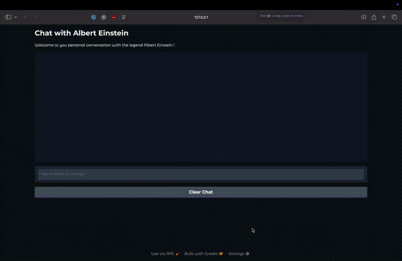

# Einstein AI Chatbot 🧠⚡

A persona-driven conversational AI chatbot that simulates Albert Einstein’s reasoning style using **Google Gemini** and **LangChain**, with an interactive **Gradio** web interface.

This project demonstrates prompt engineering, LLM integration, multi-turn conversation handling, and lightweight frontend deployment for AI applications.

---

## Demo

## 🚀 Features

- 🎭 **Einstein Persona** — Responses generated using custom prompt engineering to mimic Einstein’s voice, humor, and reasoning
- 💬 **Multi-Turn Conversations** — Maintains conversational context using structured LangChain message history
- 🖥️ **Interactive Web UI** — Built with Gradio for real-time chat interaction
- 🔐 **Secure API Management** — Environment variables managed via `.env` file
- ⚡ **Fast LLM Inference** — Powered by Google Gemini Flash model

---

## 🛠️ Tech Stack

- **Python**
- **LangChain**
- **Google Gemini API**
- **Gradio**
- **python-dotenv**

---

## 📂 Project Structure
einstein-ai-chatbot/
│── assets/
│    └── demo.gif
│── main.py
│── einstein.png
│── requirements.txt
│── README.md
│── .gitignore

---

## ⚙️ Setup & Installation

### Clone the Repository
git clone https://github.com/mazinkh/einstein-ai-chatbot.git
cd einstein-ai-chatbot

### Create Virtual Environment
python -m venv .venv
source .venv/bin/activate   # Mac/Linux

### Install Dependencies
pip install -r requirements.txt

### Add Environment Variables:
Create a .env file in the project root:
GEMINI_API_KEY=your_api_key_here

### Run the Application
python main.py
